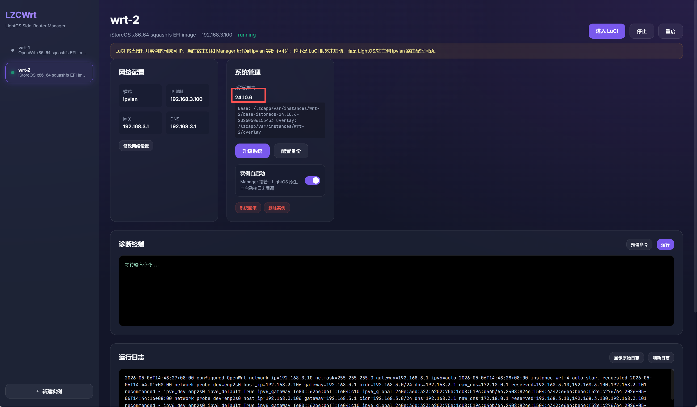
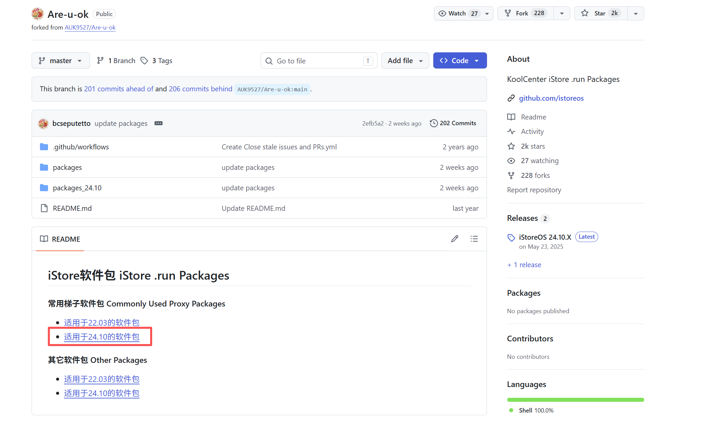
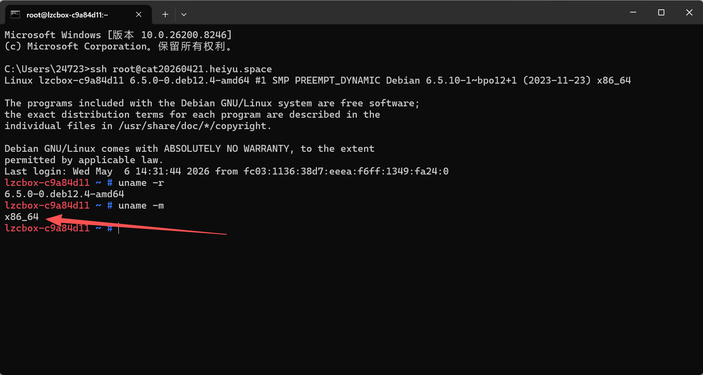
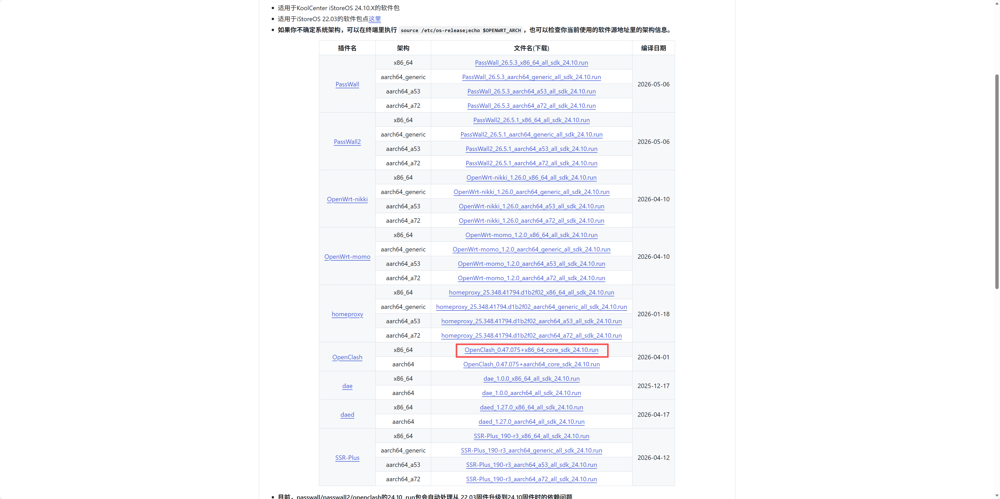
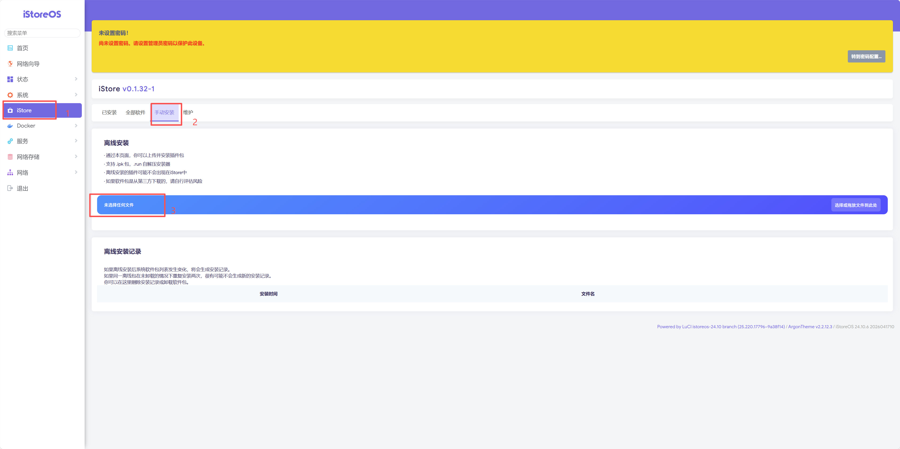

# iStoreOS 安装 OpenClash 插件

## 前言

> 这里采用的是 iStoreOS + openclash 方案
>
> 为什么采用此方案？iStoreOS 可以通过社区提供的 `.run` 包安装插件，比较方便

## 1. 下载插件

[下载插件：bcseputetto/Are-u-ok](https://github.com/bcseputetto/Are-u-ok)

在下载时，请根据您当前系统的版本来选择对应插件，这里使用的是 LZCWrt 内置的 **iStoreOS 24.10.6** 版本

请根据当前系统的平台来选择下载的版本，可以用 SSH 连接上微服后用 `uname -m` 命令查看平台架构

可以看到当前平台是 `x86_64`，所以选择 `x86_64` 平台下载

## 2. 安装插件

选择刚才下载的run文件提交
